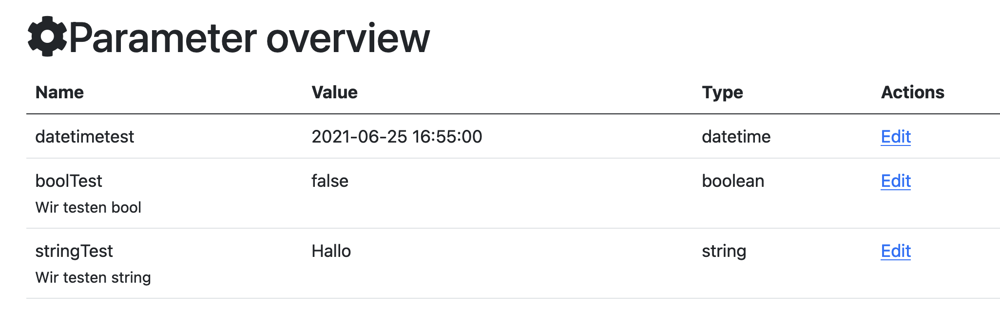

# Usage

## Entities
Create table (run `bin/console doctrine:schema:update --force`) or create a migration

## Routes
- adapt the default url prefix in config/routes/svc_param.yaml and enable translation (if you like it)

```yaml
# /config/routes/_svc_param.yaml
_svc_param:
    resource: '@SvcParamBundle/config/routes.yaml'
    prefix: /_svc_param/{_locale}
    requirements: {"_locale": "%app.supported_locales%"}
```

## Parameter
```yaml
#config/packages/svc_param.yaml
svc_param:

    # Should the deletion of parameters be allowed in the user interface
    enableDeleteParam:    false
```

## User interface

### Classic (Twig based)
- integrate the param editor via path "svc_param_index"



### EasyAdmin based

```php
use Svc\ParamBundle\Entity\Params;

class DashboardController extends AbstractDashboardController
{
  public function configureMenuItems(): iterable
  {
    ...
    yield MenuItem::linkToCrud('Params', 'fa-solid fa-paragraph', Params::class);
    ...
  }
```

## Set or get params

### Set
you have four functions to set params:
* ParamsRepository->setParam for string or general parameter
* ParamsRepository->setDateTime for a DateTime parameter
* ParamsRepository->setDate for a Date parameter
* ParamsRepository->setBool for a bool parameter
* ParamsRepository->setInteger for a integer parameter

<br />
each function use the same syntax (as exemple the setter for a string):

```php
use Svc\ParamBundle\Repository\ParamsRepository;
...
  /**
   * set a string parameter
   *
   * @param string $name parameter name
   * @param string $val
   * @param string|null $comment the comment for the param record, only set during param record creation
   * @return void
   */
  public function setParam(string $name, $val, ?string $comment = null)
```

### Get
you have four functions to get params:
* ParamsRepository->getParam for string or general parameter
* ParamsRepository->getDateTime for a DateTime parameter
* ParamsRepository->getDate for a Date parameter
* ParamsRepository->getBool for a bool parameter
* ParamsRepository->getInteger for an integer parameter

<br />
each function use the same syntax (as example the getter for a string):

```php
use Svc\ParamBundle\Repository\ParamsRepository;
...
  /**
   * get a value for a string param (or null, if not exists)
   *
   * @param string $name parameter name
   * @return string|null return value as string or null if not exists
   */
  public function getParam(string $name): ?string
```
